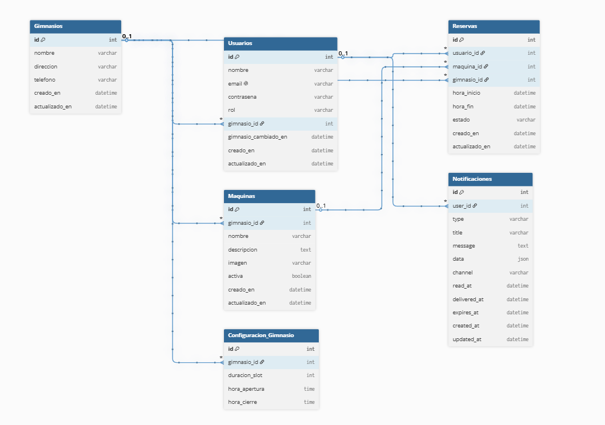

# GymNau

Plataforma web para gestionar gimnasios, máquinas y reservas con dos perfiles principales: usuario y administrador.

## 1. Título del proyecto

**GymNau - Gestión de reservas y operaciones de gimnasio**

## 2. Propuesta: explicación, objetivos y justificación

### 2.1 Explicación

GymNau es una aplicación web que permite hacer reservas de máquinas de gimnasio a los usuarios. Además, para la administración
del gimnasio, permite trackear todo el uso de las máquinas con gráficos y también una gestión total de usuarios,
reservas, máquinas y gimnasios.


### 2.2 Objetivos

- Digitalizar el proceso de reserva de máquinas.
- Reducir aglomeraciones innecesarias y conflictos de ocupación.
- Dar visibilidad operativa a los administradores.
- Ofrecer una experiencia clara tanto en móvil como en escritorio.

### 2.3 Justificación

En muchos gimnasios, la gestión de reservas es manual o inexistente. Esto provoca errores, duplicidades y, sobre todo, aglomeración de personas, lo que hace que la gente cambie de gimnasio.
GymNau centraliza la información en una sola plataforma, mejorando:

- La eficiencia operativa.
- La satisfacción de usuarios.
- La capacidad de toma de decisiones basada en datos.

## 3. Stack tecnológico y justificación

### 3.1 Frontend

- **Next.js**
	- Justificación: estructura escalable, renderizado eficiente e integración directa con React moderno.
- **Tailwind CSS**
	- Justificación: velocidad de desarrollo y consistencia visual.
- **Recharts**
	- Justificación: construcción de gráficas en el apartado de estadísticas de administración.


### 3.2 Backend (integrado vía API)

- **Laravel API** (consumida desde el frontend)
	- Justificación: separación clara frontend/backend, endpoints REST para autenticación y recursos del negocio.
- **MySQL**
	- Justificación: base de datos relacional, adecuada para gestionar relaciones entre usuarios, reservas, máquinas y gimnasios con integridad referencial, consultas eficientes y buena escalabilidad.

### 3.3 Otras decisiones técnicas

- Autenticación con token en cliente.
- Variables de entorno para separar entornos local, preview y producción.
- Arquitectura basada en módulos (`src/app` para pantallas y `src/lib` para servicios).

## 4. Herramientas de desarrollo y CI/CD

### 4.1 Herramientas de desarrollo

- **VS Code** como editor principal.
- **ESLint** para calidad de código.
- **npm** para gestión de dependencias y scripts.
- **Git/GitHub** para control de versiones y trabajo colaborativo.

### 4.2 CI/CD y despliegue

- **Vercel** para desplegar el frontend.
- **Render** para desplegar el backend.
- **AlwaysData** para subir a la nube la base de datos.


### 4.3 Uso de IA

Se ha utilizado IA como soporte en:

- Generación y refactorización de componentes.
- Detección de puntos de mejora de UX/UI.
- Soporte en resolución de errores y validación rápida de cambios.
- Generación de código con revisión constante.


### 4.4 Metodología de trabajo

Metodología **iterativa-incremental** inspirada en Scrum:

- División por historias de usuario.
- Revisión y ajuste continuo en base a feedback.

### 4.5 Diagrama de base de datos



## 5. Planificación (historias, sprints, gantt)

### 5.1 Historias de usuario (resumen)

El detalle completo de cada historia de usuario se encuentra en la carpeta `historias/` (archivos `historia1.md` a `historia12.md`).

- **Historia 1** Diseño de la estructura de datos del gimnasio.
- **Historia 2** Sistema de autenticación de usuarios.
- **Historia 3** Sistema de roles y permisos.
- **Historia 4** Gestión del gimnasio (administrador).
- **Historia 5** Gestión de máquinas (CRUD completo).
- **Historia 6** Visualización de máquinas disponibles.
- **Historia 7** Generación de slots horarios.
- **Historia 8** Crear reservas (núcleo del sistema).
- **Historia 9** Cancelar reserva.
- **Historia 10** Evitar reservas duplicadas (conflictos avanzados).
- **Historia 11** Ver mis reservas (panel de usuario).
- **Historia 12** Generación de disponibilidad en tiempo real (cierre del SaaS)

### 5.2 Sprints propuestos

- **Sprint 1:** Historia 1 y Historia 2.
- **Sprint 2:** Historia 3 y Historia 4.
- **Sprint 3:** Historia 5 y Historia 6.
- **Sprint 4:** Historia 7 y Historia 8.
- **Sprint 5:** Historia 9 y Historia 10.
- **Sprint 6:** Historia 11 y Historia 12.

### 5.3 Diagrama de Gantt (orientativo)


## 6. Casos de uso y diagrama de casos de uso

### 6.1 Actores principales

- **Usuario**
- **Administrador**

### 6.2 Casos de uso principales

- Registrarse e iniciar sesión.
- Consultar máquinas.
- Reservar y cancelar reservas.
- Consultar perfil y cambiar gimnasio (con restricciones).
- Gestionar recursos desde admin.
- Visualizar estadísticas del gimnasio.

### 6.3 Diagrama de casos de uso


## 7. Explicación del código por bloques

### 7.1 Bloque de presentación (rutas y pantallas)

- `src/app/*`
- Implementa las rutas principales de la aplicación (App Router de Next.js) y define la experiencia de cada perfil.
- Ejemplos de pantallas clave:
	- `src/app/login/page.js` y `src/app/register/page.js`: flujo de acceso y alta de usuario.
	- `src/app/machines/page.js` y `src/app/machines/[id]/page.js`: listado de máquinas y detalle con reserva.
	- `src/app/reservations/my/page.js`: gestión de reservas del usuario.
	- `src/app/admin/*`: panel y módulos de administración.
- En este bloque se decide qué ve cada usuario y en qué orden navega por las funcionalidades.

Ejemplo de ruta en App Router (pantalla de login):

```js
"use client";

import { useState } from "react";
import { loginRequest } from "@/lib/api";

export default function LoginPage() {
	const [form, setForm] = useState({ email: "", password: "" });

	const handleSubmit = async (event) => {
		event.preventDefault();
		const response = await loginRequest(form);
		const token = response?.token || response?.access_token;
		localStorage.setItem("auth_token", token);
		window.location.href = "/";
	};

	return <form onSubmit={handleSubmit}>{/* ... */}</form>;
}
```

### 7.2 Bloque de componentes reutilizables

- `src/app/_components/*` y `src/app/admin/_components/*`
- Contiene piezas reutilizables de interfaz y comportamiento para evitar duplicidad de código.
- Ejemplos:
	- Navegación y sesión: `HeaderNav.js`, `LogoutButton.js`, `AuthSessionGuard.js`.
	- Notificaciones: `NotificationBellButton.js`, `ReservationNotificationScheduler.js`.
	- Backoffice: `AdminCrudPage.js`, `AdminGymScopePicker.js`, `AdminScopedNav.js`.
- Este bloque permite mantener una UI consistente y facilita evolucionar el proyecto sin reescribir pantallas completas.

Ejemplo de componente reutilizable (logout):

```js
"use client";

import { useRouter } from "next/navigation";

export default function LogoutButton() {
	const router = useRouter();

	const handleLogout = () => {
		localStorage.removeItem("auth_token");
		document.cookie = "auth_token=; path=/; max-age=0; samesite=lax";
		router.replace("/login");
		router.refresh();
	};

	return <button onClick={handleLogout}>Logout</button>;
}
```

### 7.3 Bloque de lógica y acceso a datos

- `src/lib/api.js`
	- Capa de comunicación con la API (autenticación, usuarios, máquinas, reservas, notificaciones) y manejo centralizado de errores.
- `src/lib/admin.js`
	- Define recursos del panel admin, construye formularios dinámicos y ejecuta operaciones CRUD con validaciones.
- `src/lib/gym.js`, `src/lib/session.js`, `src/lib/notifications.js`, etc.
	- Utilidades de dominio (scope por gimnasio), sesión (lectura de estado de autenticación) y notificaciones de app.
- Flujo general de datos:
	1. La vista dispara una acción del usuario.
	2. El componente llama a funciones de `src/lib/*`.
	3. La librería consulta la API y normaliza la respuesta.
	4. La vista actualiza estado y renderiza el resultado.

Ejemplo de helper para peticiones HTTP:

```js
export async function apiRequest(path, { method = "GET", body, token } = {}) {
	const response = await fetch(`${process.env.NEXT_PUBLIC_API_URL}${path}`, {
		method,
		headers: {
			"Content-Type": "application/json",
			...(token ? { Authorization: `Bearer ${token}` } : {}),
		},
		body: body ? JSON.stringify(body) : undefined,
	});

	if (!response.ok) {
		throw new Error("Error en la petición a la API");
	}

	return response.json();
}
```

### 7.4 Bloque de estilos globales

- `src/app/globals.css`
- Define tokens visuales, paleta, tipografías, espaciados y estilos base reutilizados por toda la aplicación.
- Incluye clases comunes para tarjetas, botones, badges, formularios y layouts responsive.
- Su objetivo es asegurar coherencia visual entre el área de usuario y el panel de administración.

Ejemplo de estilos globales:

```css
:root {
	--foreground: #0f172a;
	--muted: #64748b;
	--primary: #0f766e;
}

.surface-card {
	border: 1px solid #e2e8f0;
	border-radius: 12px;
	background: #ffffff;
}

.btn-primary {
	background: var(--primary);
	color: white;
}
```

### 7.5 Bloque de recursos estáticos

- `public/*`
- Almacena recursos servidos directamente por Next.js sin pasar por transformaciones de build.
- Contiene imágenes de marca y diagramas del proyecto (`logoGymNau.png`, `diagramadegantt.png`, `diagramadecasosdeuso.png`, `diagramabd.png`).
- Incluye `sw-notifications.js`, usado para mostrar recordatorios y acciones de notificaciones del navegador.

Ejemplo de uso de un recurso estático en una vista:

```js
import Link from "next/link";

export default function Brand() {
	return (
		<Link href="/" className="flex items-center gap-3">
			
			<span>GymNau</span>
		</Link>
	);
}
```

## 8. Instrucciones de ejecución

### 8.1 Requisitos

- Node.js LTS
- npm

### 8.2 Instalación

```bash
npm install
```

### 8.3 Ejecución en local

```bash
npm run dev
```

### 8.4 Variables de entorno necesarias

- `NEXT_PUBLIC_APP_URL`
- `NEXT_PUBLIC_API_URL`
- `NEXT_PUBLIC_BACKEND_URL`
- `NEXT_PUBLIC_SANCTUM_CSRF_URL`

## 9. Estado actual y futuras mejoras

### 9.1 Estado actual

- Funcionalidades principales implementadas para usuario y administrador.
- Integración con API para datos de negocio.
- Panel de estadísticas operativo.

### 9.2 Mejoras futuras

- Tests automatizados.
- Implementar un nuevo rango de administración de solo un gimnasio en específico.
- Añadir QR a las máquinas.
- Configuración de gimnasio.


## 10. Manual de uso


### 10.1 Usuarios de prueba y roles

Puedes usar estos usuarios de prueba para validar el funcionamiento del sistema:

- Administrador
Correo: admin@example.com
Contraseña: Admin12345
Rol: admin

- Usuario
Correo: pepe@gmail.com
Contraseña: pepe1234
Rol: user

### 10.2 Instrucciones básicas para registrarte

1. Abre la aplicación en el navegador.
2. Entra en la pantalla de registro en /register.
3. Completa los campos obligatorios:

- Nombre
- Email
- Contraseña
- Confirmación de contraseña
- Gimnasio

4. Pulsa el botón Crear cuenta.
5. Si todo es correcto, el sistema te redirige al login.

### 10.3 Instrucciones básicas para iniciar sesión

1. Entra en la pantalla de login en /login.
2. Introduce tu email y contraseña.
3. Pulsa el botón Iniciar sesión.
4. Si las credenciales son válidas, accederás a la aplicación.

Consejo:
Si no quieres registrarte ahora, puedes usar uno de los usuarios de prueba del apartado 10.1.


