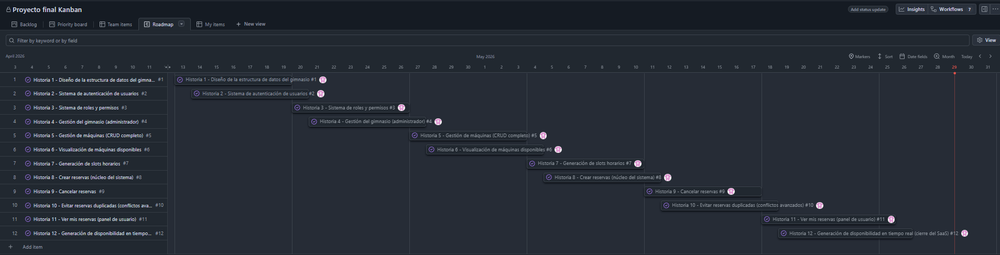
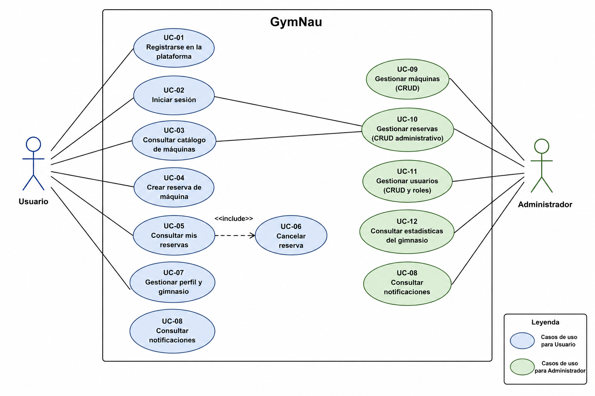

# GymNau

Plataforma web para gestionar gimnasios, maquinas y reservas con dos perfiles principales: usuario y administrador.

## 1. Titulo del proyecto

**GymNau - Gestion de reservas y operaciones de gimnasio**

## 2. Propuesta: explicacion, objetivos y justificacion

### 2.1 Explicacion

GymNau es una aplicacion web que permite hacer reservas de maquinas de gimnasio a los usuarios, ademas para la administración
del gimnasio permite trackear todo el uso de las maquinas con graficos, tambien permite una gestión total tanto de usuarios, 
reservas, maquinas y gimnasios.


### 2.2 Objetivos

- Digitalizar el proceso de reserva de maquinas.
- Reducir aglomeraciones innecesarias y conflictos de ocupacion.
- Dar visibilidad operativa a los administradores.
- Ofrecer una experiencia clara tanto en movil como en escritorio.

### 2.3 Justificacion

En muchos gimnasios, la gestion de reservas es manual o inecxistente. Esto provoca errores, duplicidades y sobretodo mucha aglomeraccion de personas que provoca que la gente cambie de gimnasio.
GymNau centraliza la informacion en una sola plataforma, mejorando:

- La eficiencia operativa.
- La satisfaccion de usuarios.
- La capacidad de toma de decisiones basada en datos.

## 3. Stack tecnologico y justificacion

### 3.1 Frontend

- **Next.js**
	- Justificacion: estructura escalable, renderizado eficiente e integracion directa con React moderno.
- **Tailwind CSS**
	- Justificacion: velocidad de desarrollo y consistencia visual.
- **Recharts**
	- Justificacion: construccion de graficas en el apartado de estadisticas de administracion.


### 3.2 Backend (integrado via API)

- **Laravel API** (consumida desde el frontend)
	- Justificacion: separacion clara frontend/backend, endpoints REST para autenticacion y recursos del negocio.
- **MySQL**
	- Justificacion: base de datos relacional, adecuada para gestionar relaciones entre usuarios, reservas, maquinas y gimnasios con integridad referencial, consultas eficientes y buena escalabilidad.

### 3.3 Otras decisiones tecnicas

- Autenticacion con token en cliente.
- Variables de entorno para separar entornos local, preview y produccion.
- Arquitectura basada en modulos (`src/app` para pantallas y `src/lib` para servicios).

## 4. Herramientas de desarrollo y CI/CD

### 4.1 Herramientas de desarrollo

- **VS Code** como editor principal.
- **ESLint** para calidad de codigo.
- **npm** para gestion de dependencias y scripts.
- **Git/GitHub** para control de versiones y trabajo colaborativo.

### 4.2 CI/CD y despliegue

- **Vercel** para desplegar el frontend.
- **Render** para desplegar el backend.
- **AlwaysData** para subir a la nube la base de datos.


### 4.3 Uso de IA

Se ha utilizado IA como soporte en:

- Generacion y refactorizacion de componentes.
- Deteccion de puntos de mejora de UX/UI.
- Soporte en resolucion de errores y validacion rapida de cambios.
- Generar codigo con revisión constante


### 4.4 Metodologia de trabajo

Metodologia **iterativa-incremental** inspirada en Scrum:

- Division por historias de usuario.
- Revision y ajuste continuo en base a feedback.

## 5. Planificacion (historias, sprints, gantt)

### 5.1 Historias de usuario (resumen)

- **Historia 1** Diseño de la estructura de datos del gimnasio.
- **Historia 2** Sistema de autenticación de usuarios.
- **Historia 3** Sistema de roles y permisos.
- **Historia 4** Gestión del gimnasio (administrador).
- **Historia 5** Gestión de máquinas (CRUD completo).
- **Historia 6** Visualización de máquinas disponibles.
- **Historia 7** Generación de slots horarios.
- **Historia 8** Crear reservas (núcleo del sistema).
- **Historia 9** Cancelar reserva.
- **Historia 10** Evitar reservas duplicadas (conflictos avanzados).
- **Historia 11** Ver mis reservas (panel de usuario).
- **Historia 12** Generación de disponibilidad en tiempo real (cierre del SaaS)

### 5.2 Sprints propuestos

- **Sprint 1:** Historia 1 y Historia 2.
- **Sprint 2:** Historia 3 y Historia 4.
- **Sprint 3:** Historia 5 y Historia 6.
- **Sprint 4:** Historia 7 y Historia 8.
- **Sprint 5:** Historia 9 y Historia 10.
- **Sprint 6:** Historia 11 y Historia 12.

### 5.3 Diagrama de Gantt (orientativo)




## 6. Casos de uso y diagrama de casos de uso

### 6.1 Actores principales

- **Usuario**
- **Administrador**

### 6.2 Casos de uso principales

- Registrarse e iniciar sesion.
- Consultar maquinas.
- Reservar y cancelar reservas.
- Consultar perfil y cambiar gimnasio (con restricciones).
- Gestionar recursos desde admin.
- Visualizar estadisticas del gimnasio.

### 6.3 Diagrama de casos de uso



## 7. Explicacion del codigo por bloques

### 7.1 Bloque de presentacion (rutas y pantallas)

- `src/app/*`
- Contiene las paginas de login, registro, dashboard, maquinas, perfil, notificaciones y administracion.

### 7.2 Bloque de componentes reutilizables

- `src/app/_components/*` y `src/app/admin/_components/*`
- Componentes de navegacion, botones, protecciones de sesion, selectores y paneles de gestion.

### 7.3 Bloque de logica y acceso a datos

- `src/lib/api.js`
	- Wrapper de peticiones HTTP, gestion de errores y normalizacion de respuestas.
- `src/lib/admin.js`
	- Definicion de recursos de admin, mapeo de formularios y operaciones CRUD.
- `src/lib/gym.js`, `src/lib/session.js`, `src/lib/notifications.js`, etc.
	- Utilidades de dominio, sesion, notificaciones y normalizaciones auxiliares.

### 7.4 Bloque de estilos globales

- `src/app/globals.css`
- Variables de diseño, sistema de superficies, botones y patrones visuales comunes.

### 7.5 Bloque de recursos estaticos

- `public/*`
- Scripts y assets publicos (imagenes, service worker de notificaciones, placeholders).

## 8. Instrucciones de ejecucion

### 8.1 Requisitos

- Node.js LTS
- npm

### 8.2 Instalacion

```bash
npm install
```

### 8.3 Ejecucion en local

```bash
npm run dev
```

### 8.4 Variables de entorno necesarias

- `NEXT_PUBLIC_APP_URL`
- `NEXT_PUBLIC_API_URL`
- `NEXT_PUBLIC_BACKEND_URL`
- `NEXT_PUBLIC_SANCTUM_CSRF_URL`

## 9. Estado actual y futuras mejoras

### 9.1 Estado actual

- Funcionalidades principales implementadas para usuario y administrador.
- Integracion con API para datos de negocio.
- Panel de estadisticas operativo.

### 9.2 Mejoras futuras

- Tests automatizados.
- Implementar un nuevo rango de administración de solo un gimnasio en especifico
- Añadir QR a las maquinas


## 10. Manual de uso


### 10.1 Usuarios de prueba y roles

Puedes usar estos usuarios de prueba para validar el funcionamiento del sistema:

- Administrador
Correo: admin@example.com
Contraseña: Admin12345
Rol: admin

- Usuario
Correo: pepe@gmail.com
Contraseña: pepe1234
Rol: user

### 10.2 Instrucciones basicas para registrarte

1. Abre la aplicacion en el navegador.
2. Entra en la pantalla de registro en /register.
3. Completa los campos obligatorios:

- Nombre
- Email
- Contraseña
- Confirmacion de contraseña
- Gimnasio

4. Pulsa el boton Crear cuenta.
5. Si todo es correcto, el sistema te redirige al login.

### 10.3 Instrucciones basicas para logearte

1. Entra en la pantalla de login en /login.
2. Introduce tu email y contrasena.
3. Pulsa el boton Iniciar sesion.
4. Si las credenciales son validas, accederas a la aplicacion.

Consejo:
Si no quieres registrarte ahora, puedes usar uno de los usuarios de prueba del apartado 10.1.


