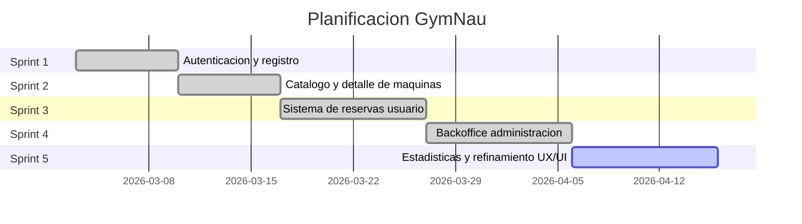
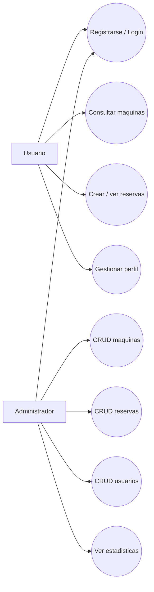

# GymNau

Plataforma web para gestionar gimnasios, maquinas y reservas con dos perfiles principales: usuario final y administrador.

## 1. Titulo del proyecto

**GymNau - Gestion de reservas y operaciones de gimnasio**

## 2. Propuesta: explicacion, objetivos y justificacion

### 2.1 Explicacion

GymNau es una aplicacion web que permite:

- Consultar maquinas disponibles.
- Reservar franjas horarias para una maquina.
- Gestionar el perfil de usuario y el gimnasio asignado.
- Administrar recursos del sistema desde un backoffice (maquinas, reservas, usuarios y estadisticas).

### 2.2 Objetivos

- Digitalizar el proceso de reserva de maquinas.
- Reducir cuellos de botella y conflictos de ocupacion.
- Dar visibilidad operativa a los administradores.
- Ofrecer una experiencia clara tanto en movil como en escritorio.

### 2.3 Justificacion

En muchos gimnasios, la gestion de reservas es manual o fragmentada (papel, mensajeria, hojas de calculo). Esto provoca errores, duplicidades y poca trazabilidad. GymNau centraliza la informacion en una sola plataforma, mejorando:

- La eficiencia operativa.
- La satisfaccion de usuarios.
- La capacidad de toma de decisiones basada en datos.

## 3. Stack tecnologico y justificacion

### 3.1 Frontend

- **Next.js (App Router)**
	- Justificacion: estructura escalable, renderizado eficiente e integracion directa con React moderno.
- **React 19**
	- Justificacion: componentizacion, reutilizacion y gestion declarativa de la UI.
- **Tailwind CSS v4**
	- Justificacion: velocidad de desarrollo y consistencia visual.
- **Recharts**
	- Justificacion: construccion de graficas en el apartado de estadisticas de administracion.

### 3.2 Backend (integrado via API)

- **Laravel API** (consumida desde el frontend)
	- Justificacion: separacion clara frontend/backend, endpoints REST para autenticacion y recursos del negocio.

### 3.3 Otras decisiones tecnicas

- Autenticacion con token en cliente.
- Variables de entorno para separar entornos local, preview y produccion.
- Arquitectura basada en modulos (`src/app` para pantallas y `src/lib` para servicios/normalizacion).

## 4. Herramientas de desarrollo y CI/CD

### 4.1 Herramientas de desarrollo

- **VS Code** como editor principal.
- **ESLint** para calidad de codigo.
- **npm** para gestion de dependencias y scripts.
- **Git/GitHub** para control de versiones y trabajo colaborativo.

### 4.2 CI/CD y despliegue

- **Vercel** para desplegar el frontend.
- Flujo de despliegue orientado a ramas (preview/produccion).
- Configuracion de entorno via variables (`NEXT_PUBLIC_API_URL`, etc.).

### 4.3 Uso de IA

Se ha utilizado IA como soporte en:

- Generacion y refactorizacion de componentes.
- Deteccion de puntos de mejora de UX/UI.
- Soporte en resolucion de errores y validacion rapida de cambios.

La IA se ha usado como asistente, manteniendo revision humana sobre decisiones de producto y arquitectura.

### 4.4 Metodologia de trabajo

Metodologia **iterativa-incremental** inspirada en Scrum:

- Division por historias de usuario.
- Entregas cortas por funcionalidades.
- Revision y ajuste continuo en base a feedback.

## 5. Planificacion (historias, sprints, gantt)

### 5.1 Historias de usuario (resumen)

- Como usuario, quiero registrarme e iniciar sesion para acceder al sistema.
- Como usuario, quiero ver maquinas y reservar franjas disponibles.
- Como usuario, quiero consultar y gestionar mis reservas.
- Como administrador, quiero gestionar maquinas, reservas y usuarios.
- Como administrador, quiero ver estadisticas para optimizar la gestion del gimnasio.

### 5.2 Sprints propuestos

- **Sprint 1:** autenticacion, registro, estructura base de navegacion.
- **Sprint 2:** catalogo de maquinas y detalle.
- **Sprint 3:** flujo completo de reservas de usuario.
- **Sprint 4:** panel admin CRUD (maquinas, reservas, usuarios, gimnasios).
- **Sprint 5:** estadisticas, mejoras UX/UI, estabilizacion y deploy.

### 5.3 Diagrama de Gantt (orientativo)



## 6. Casos de uso y diagrama de casos de uso

### 6.1 Actores principales

- **Usuario**
- **Administrador**

### 6.2 Casos de uso principales

- Registrarse e iniciar sesion.
- Consultar maquinas.
- Reservar y cancelar reservas.
- Consultar perfil y cambiar gimnasio (con restricciones).
- Gestionar recursos desde admin.
- Visualizar estadisticas del gimnasio.

### 6.3 Diagrama de casos de uso



## 7. Explicacion del codigo por bloques

### 7.1 Bloque de presentacion (rutas y pantallas)

- `src/app/*`
- Contiene las paginas de login, registro, dashboard, maquinas, perfil, notificaciones y administracion.

### 7.2 Bloque de componentes reutilizables

- `src/app/_components/*` y `src/app/admin/_components/*`
- Componentes de navegacion, botones, protecciones de sesion, selectores y paneles de gestion.

### 7.3 Bloque de logica y acceso a datos

- `src/lib/api.js`
	- Wrapper de peticiones HTTP, gestion de errores y normalizacion de respuestas.
- `src/lib/admin.js`
	- Definicion de recursos de admin, mapeo de formularios y operaciones CRUD.
- `src/lib/gym.js`, `src/lib/session.js`, `src/lib/notifications.js`, etc.
	- Utilidades de dominio, sesion, notificaciones y normalizaciones auxiliares.

### 7.4 Bloque de estilos globales

- `src/app/globals.css`
- Variables de diseño, sistema de superficies, botones y patrones visuales comunes.

### 7.5 Bloque de recursos estaticos

- `public/*`
- Scripts y assets publicos (imagenes, service worker de notificaciones, placeholders).

## 8. Instrucciones de ejecucion

### 8.1 Requisitos

- Node.js LTS
- npm

### 8.2 Instalacion

```bash
npm install
```

### 8.3 Ejecucion en local

```bash
npm run dev
```

### 8.4 Variables de entorno necesarias

- `NEXT_PUBLIC_APP_URL`
- `NEXT_PUBLIC_API_URL`
- `NEXT_PUBLIC_BACKEND_URL`
- `NEXT_PUBLIC_SANCTUM_CSRF_URL`

## 9. Estado actual y futuras mejoras

### 9.1 Estado actual

- Funcionalidades principales implementadas para usuario y administrador.
- Integracion con API para datos de negocio.
- Panel de estadisticas operativo.

### 9.2 Mejoras futuras

- Tests automatizados (unitarios y e2e).
- Internacionalizacion.
- Mejora de monitorizacion y observabilidad.
- Mecanismos avanzados de cache y optimizacion de rendimiento.
